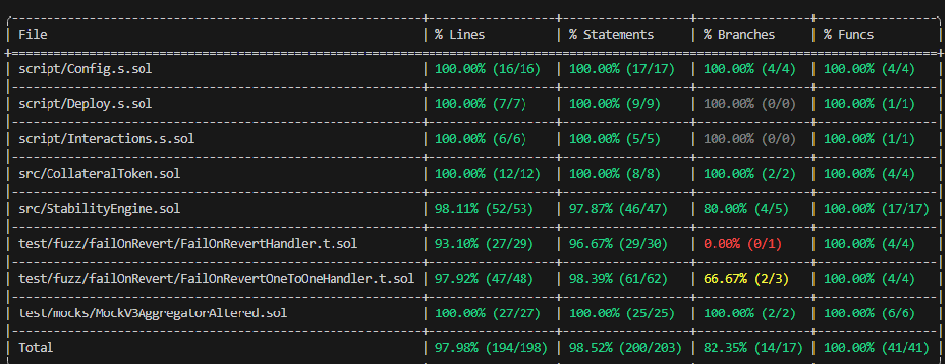

# USDStableProtocol  

## Overview  
This project is an alternative to traditional stablecoins, addressing the risks associated with price fluctuations. Instead of directly purchasing a stablecoin, users acquire a **collateral token**, which is deposited into the system. The system then calculates the USD value based on the collateral token's price. At any time, users can withdraw their funds, and the system mints the necessary tokens accordingly.  

> **Note:** The system currently operates **on official testnets and local Anvil nodes**. It is not compatible with real Chainlink price feeds on the mainnet. The system can be used for price updates and testing on local Anvil nodes, where you can also manually update prices for testing purposes. 

For a deeper understanding, refer to the **smart contract files**.

## Requirements  
- [Foundry](https://github.com/foundry-rs/foundry) (for compiling, deploying, and testing contracts)  

## Quickstart  

### 1. Install Foundry  
```sh
curl -L https://foundry.paradigm.xyz | bash  
foundryup  
```  

### 2. Clone the repository  
```sh
git clone https://github.com/devak07/USDStableProtocol.git  
cd USDStableProtocol  
```  

### 3. Install dependencies  
```sh
make install  
```  

### 4. Configure `foundry.toml` (Required for Some Tests)  
To ensure some tests run correctly, update the `foundry.toml` file with the necessary RPC endpoints:  
```toml
rpc_endpoints = { rpc-ethmainnet = "<YOUR_RPC_URL>", rpc-amoy = "<YOUR_RPC_URL>", anvil-rpc = "127.0.0.1:8545" }
```

### 5. Compile the contracts  
```sh
forge build  
```  

## Deployment  

⚠️ **This system can be deployed on a local Anvil node or testnet, but it should not be deployed on the mainnet.**  
For testing purposes, you can deploy the contracts on a **local Anvil node** or an **official testnet**. However, deployment to the mainnet is not supported due to limitations with Chainlink price feeds.

### Deploying on a Local Anvil Node or Testnet  

1. Set up your environment variables (e.g., private key, RPC URL, etc.).  
2. Run the deployment script:  
   ```sh
   forge script script/Deploy.s.sol --rpc-url <TESTNET_RPC_OR_ANVIL_URL> --private-key <YOUR_PRIVATE_KEY> --broadcast  
   ```  
3. After deployment, set up **Chainlink VRF & Keepers** for automated price updates if deploying on a testnet.  

### Important Notice  
In the **StabilityEngine** contract, there is a function designed for test environments, which should be **removed** before deployment to the mainnet. This function is only used for testing purposes and could potentially cause issues if left in the contract on the mainnet. If you're deploying to the mainnet, make sure to remove it.

## Testing  

### Running Tests Locally (Anvil)  

1. Start an Anvil local node.  
2. Run the tests:  
   ```sh
   forge test  
   ```  

### Running Tests on a Testnet  
1. Deploy contracts to a testnet.  
2. Run test scripts:  
   ```sh
   forge script script/Deploy.s.sol --rpc-url <TESTNET_RPC> --private-key <YOUR_PRIVATE_KEY> --broadcast  
   ```  

### Testing Interactions  
Before testing interactions, you must **first deploy the contract on Anvil** using the deployment script:
```sh
forge script script/Deploy.s.sol --rpc-url anvil-rpc --private-key <YOUR_PRIVATE_KEY> --broadcast
```
Once the contract is deployed, you can run interaction tests.

### Obtaining 10 Tokens for Testing  
To obtain the 10 tokens for testing, you can run the following command after deploying the contracts:

```sh
forge script script/Interactions.s.sol:GetTenTokensAndDeposit --rpc-url <TESTNET_RPC_OR_ANVIL_URL> --private-key <YOUR_PRIVATE_KEY> --broadcast 
```

This command will interact with the deployed contract to retrieve the 10 tokens and deposit them. Ensure you are running this script after the contract has been deployed to your local Anvil node or testnet.

## Testing & Security  
✅ All smart contracts have been **fully tested** however, those branches that are not tested, are simple Invariant Reverts (**failOnRevert is set to true**).  
  
⚠️ **Note:** The system **cannot be deployed on the mainnet**. It only works on local Anvil nodes and official testnets due to limitations with the Chainlink price feeds.  

Additionally, while the **contract** can be tested locally or on testnets, **there will be an update** to enable contract testing directly on the [project website](#) in the future. Until that is up and running, you can continue testing manually by deploying to a local node or testnet.

**Author: Andrzej Knapik**  
**Github: akdev07**

